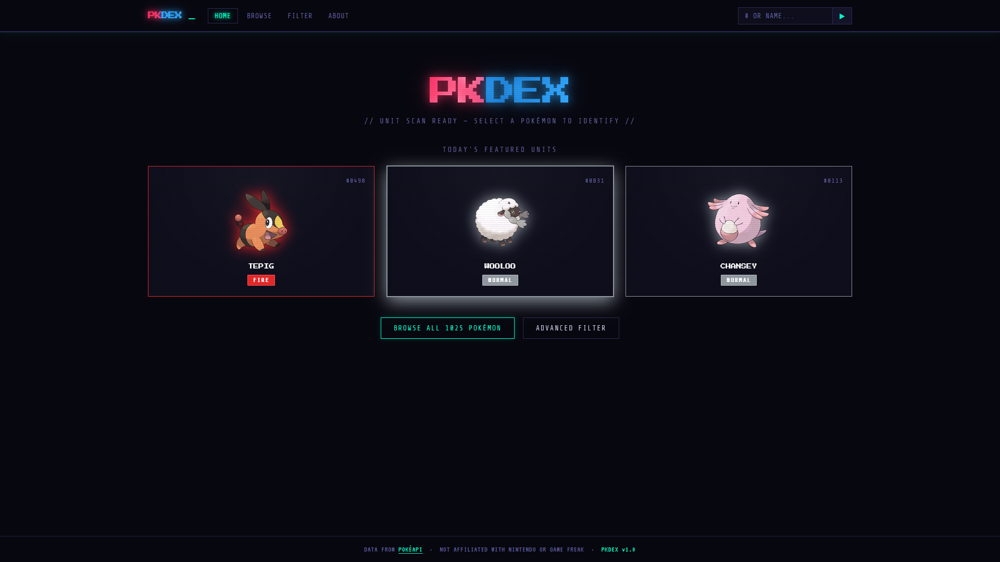
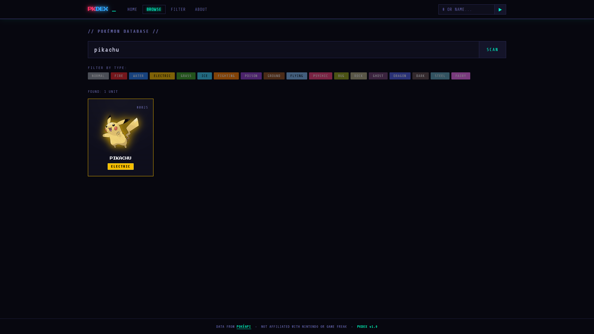
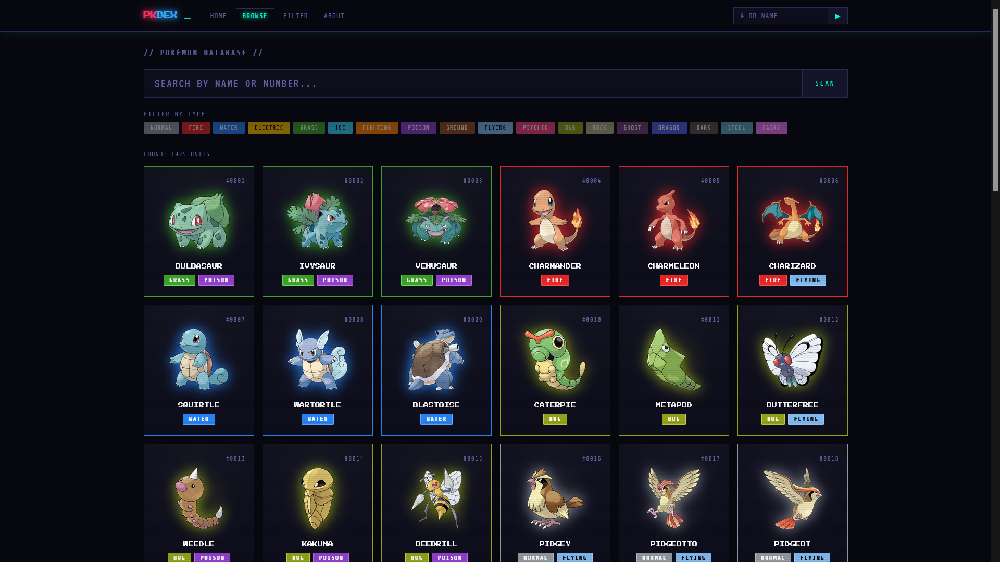
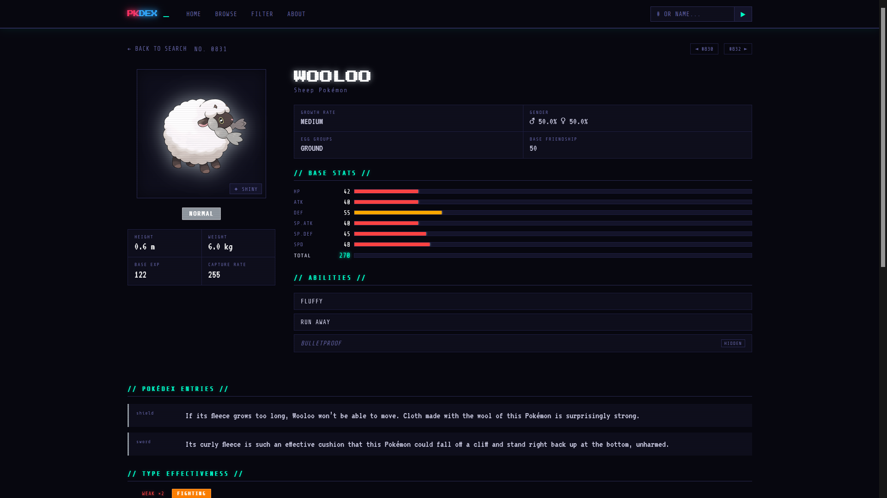
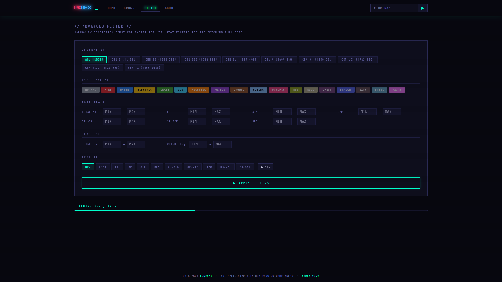
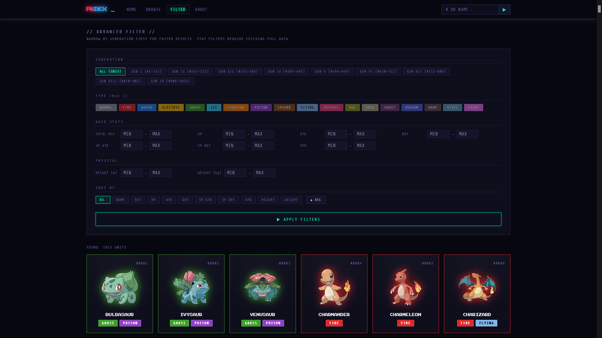

# PKDEX
  
A retro-styled Pokédex built for the web. It pulls data from [PokéAPI](https://pokeapi.co) and presents it through a dark, CRT-terminal aesthetic inspired by 90s computer interfaces — think green-on-black screens, scanline overlays, and pixel fonts, rather than the clean corporate look of most fan sites.  
Live at **[pkdex-omega.vercel.app](https://pkdex-omega.vercel.app)**  

---

## Features

**Home** — Three random Pokémon are shown each time you visit. Click any of them to dive straight into their entry, or head to Browse or Filter from the nav.

**Browse** — Search by name or Pokédex number, or filter the full list by type. Results are paginated and load more on demand.

**Filter** — A more powerful search tool. Narrow down Pokémon by generation, type, base stats (total BST, HP, Attack, Defense, Sp. Atk, Sp. Def, Speed), height, and weight. Sort results by any of those stats in ascending or descending order. The filter fetches and checks Pokémon in batches with a live progress bar.

**Pokémon entry** — Each Pokémon gets a full detail page:
- Official artwork with a shiny toggle, click the image to view it fullscreen
- Base stats with animated bars
- Abilities with expandable descriptions
- A synthesized bio that combines all Pokédex flavor text entries into one coherent paragraph (powered by Claude AI, only available on Vercel)
- All individual Pokédex entries from every game
- Type effectiveness chart
- Evolution chain, including branching evolutions like Eevee
- Full move list, tabbed by learn method

---

## Screenshots

**Home — three random Pokémon on every visit**

**Browse — search by name**

**Browse — full listing**

**Pokémon entry — full detail page**

**Advanced Filter — before applying**

**Advanced Filter — results**

---

## Stack

- Vanilla HTML, CSS, and JavaScript — no build tools, no frameworks
- Hash-based routing (`#/`, `#/search`, `#/filter`, `#/pokemon/25`) for static hosting compatibility
- [PokéAPI](https://pokeapi.co) for all Pokémon data
- [Anthropic Claude](https://anthropic.com) (Haiku) for AI-generated bios, proxied through a Vercel serverless function

---

## Running locally

Just open `index.html` in a browser. No install step needed.

The AI bio feature requires a Vercel deployment with `ANTHROPIC_API_KEY` set as an environment variable. On GitHub Pages or when opened locally, the bio section is simply hidden.

---

## Hosting

Deployed on Vercel. `vercel.json` includes a rewrite rule so all routes serve `index.html`, while `/api/*` routes reach the serverless functions.
